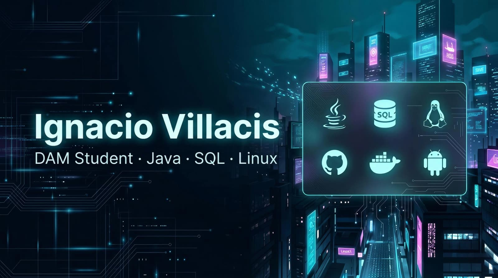

  

  

---

<h2 align="center">⚡ Sobre mí</h2>

Soy estudiante de <b>Desarrollo de Aplicaciones Multiplataforma (DAM)</b> con un perfil en crecimiento orientado a <b>backend</b>, <b>bases de datos</b>, <b>Linux</b> e <b>integración de servicios</b>.

Me gusta trabajar sobre proyectos que tengan una base técnica clara: aplicaciones en <b>Java</b>, persistencia de datos, consumo de <b>APIs</b>, desarrollo Android y entornos de sistemas donde el software no solo funcione, sino que también esté bien organizado y bien presentado.

Mi objetivo es construir un perfil junior sólido, con repositorios limpios, buena documentación y proyectos que reflejen evolución real a lo largo del ciclo.

---

<h2 align="center">🌌 Proyecto actual</h2>

<b>StreetHunter</b> es mi TFG, desarrollado en equipo, y está enfocado en la gamificación del turismo local en Vallecas mediante una app Android nativa.

Incluye una mecánica de <b>“Niebla de Guerra”</b>, validación por <b>GPS / geofencing</b>, retos tipo <b>quiz</b> y ranking global, con arquitectura apoyada en <b>Firebase Authentication</b>, <b>Cloud Firestore</b> y <b>Google Maps</b>.

<b>Base técnica:</b> Java · Android · Firebase · Google Maps · GPS / Geofencing

---

<h2 align="center">🚀 Stack tecnológico</h2>

### 
💻 Desarrollo y datos

  

### 
🛠️ Sistemas y herramientas

  

### 
🧰 Entornos de desarrollo

  

  
  

---

<h2 align="center">🏆 Proyectos destacados</h2>

Selección de proyectos desarrollados a lo largo de <b>DAM</b> y elegidos por ser los que mejor representan mi evolución técnica.

<table align="center" width="100%">
  <tr>
    <td width="50%" valign="top" align="center">
      <h3>🚀 <a href="https://github.com/Nacho6002/DAM-II-Procesos-y-Servicios">Servicio REST FTP/Mail</a></h3>
      
Microservicio backend orientado a transferencia de archivos y envío automatizado de correos.

      
<b>Tecnologías:</b> Java · Spring Boot · Docker · FTP

    </td>
    <td width="50%" valign="top" align="center">
      <h3>🏫 <a href="https://github.com/Nacho6002/DAM-II---Acceso-a-Datos">Gestión de Institutos</a></h3>
      
Proyecto académico centrado en persistencia, entidades, relaciones y modelado relacional.

      
<b>Tecnologías:</b> Java · JPA / Hibernate · MySQL · Docker

    </td>
  </tr>
  <tr>
    <td width="50%" valign="top" align="center">
      <h3>🌤️ <a href="https://github.com/Nacho6002/DAM-II-Programacion-multimedia-y-dispositivos-moviles">Weather App Android</a></h3>
      
Aplicación móvil con consumo de API externa, almacenamiento local y arquitectura basada en componentes.

      
<b>Tecnologías:</b> Android · Retrofit · Room · LiveData

    </td>
    <td width="50%" valign="top" align="center">
      <h3>👾 <a href="https://github.com/Nacho6002/DAM-II-Programacion-de-Videojuegos">Insect Smasher</a></h3>
      
Videojuego arcade 2D enfocado en lógica de juego, colisiones y gestión de estados.

      
<b>Tecnologías:</b> Godot · GDScript

    </td>
  </tr>
</table>

---

<h2 align="center">🧠 Perfil técnico</h2>

  <table>
    <tr>
      <td align="center"><b>Formación</b></td>
      <td align="center">Finalizando DAM y reforzando una base sólida en software, datos, Android y sistemas.</td>
    </tr>
    <tr>
      <td align="center"><b>Intereses</b></td>
      <td align="center">Backend, bases de datos, Linux, APIs, Android e integración de servicios.</td>
    </tr>
    <tr>
      <td align="center"><b>Forma de trabajar</b></td>
      <td align="center">Repositorios limpios, estructura clara, documentación cuidada y mejora continua.</td>
    </tr>
    <tr>
      <td align="center"><b>Objetivo</b></td>
      <td align="center">Seguir creciendo como desarrollador junior con perfil técnico serio y bien construido.</td>
    </tr>
  </table>

---

<h2 align="center">🤝 Contacto</h2>

  
  &nbsp;&nbsp;&nbsp;
  

  <code>ivillacis6002@gmail.com</code>

